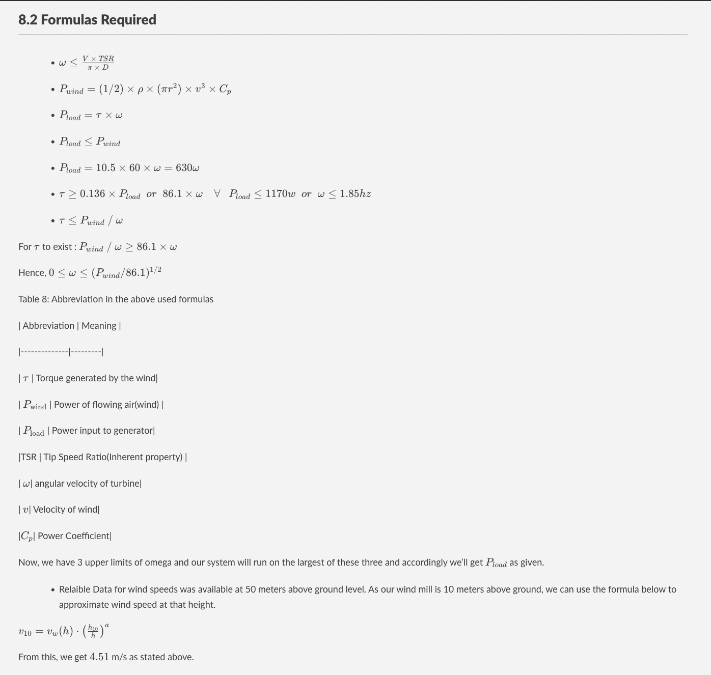

# WindEnergy_Toolbox_Tribe-D
Python Script to get all relevant required Information regarding the Wind-Energy produced.

## Requirements
- Python (Version 3+) - If you're not familiar with python check out this out [Python Official Install](https://www.python.org/downloads/) 
- Numpy - If you're not familiar with numpy check out [Numpy Official Install](https://numpy.org/install/)

## Getting Started
Run the "windbox.py" file (if you've never run a python file check this out [Python Run guide](https://www.tutorialspoint.com/how-to-run-python-program))
and everything else of need would be told to you in the scipt itself.

##  8.1 Case Study of Chennai's Wind Energy

  

A case study of potential wind energy production at Chennai was performed.

[@AssessmentWindEnergy]

  

Average windspeed in Chennai= 4.51 m/s

[@1011770144598719875276fig11]

  

Monthly Units at Average Wind Speed ~ 260 units/month (best case assuming 100% effciency)

  

Fig 1: Map Showing Wind Power Potential

[@FigureMapShowing]

  

